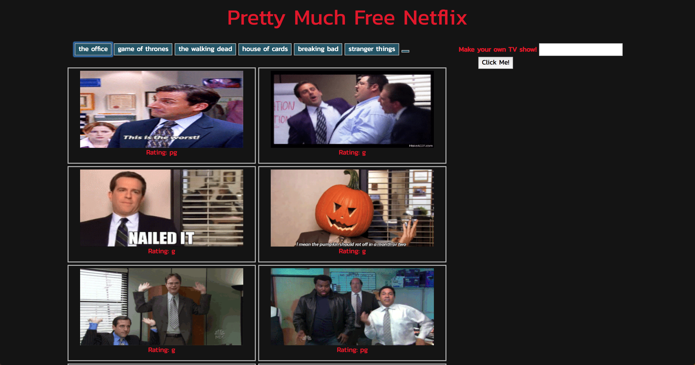

<h1 align="center">📺 Pretty Much Netflix 📺</h1>

This app allows users to see gifs from their favorite TV shows stacked neatly against one another on a sleek background. 

You are given some of my favorite TV Shows to start with, but you can add your own shows using the search button. Once you've hit submit, you'll get your very own button to generate gifs from YOUR favorite shows. 

This app uses the gify API to call for 10 gifs from any given show (all though the search bar can return gifs of any sort, not just TV shows).


Click [here](https://sashapatsel.github.io/pretty-much-netflix/) to try.




### Installing

Feel free to clone this repository! No other installation necessary.


## Built With

* HTML 
* CSS
* JQuery
* AJAX


## Code Snippets
This is the AJAX call that gives you all the amazing gifs!
```javascript
	      $.ajax({
          url: queryURL,
          method: "GET"
        })
        .then(function(response) {
          var results = response.data;

          for (var i = 0; i < results.length; i++) {
            var gifDiv = $("<div class='item'>");

            var rating = results[i].rating;

            var masterDiv = $("<div class='img-container col-md-4'>")

            var p = $("<p>").text("Rating: " + rating);
            p.addClass("rating")

            var chosenImage = $("");
            chosenImage.attr("src", results[i].images.fixed_height_still.url);
            chosenImage.attr("data-still", results[i].images.fixed_height_still.url)
            chosenImage.attr("data-animate", results[i].images.fixed_height.url)
            chosenImage.attr("data-state", "still")
            chosenImage.addClass("gif")
            gifDiv.prepend(chosenImage);
            masterDiv.prepend(gifDiv)
            masterDiv.append(p)
            $(".more-gifs").prepend(masterDiv);

          }
        });

```

## Authors

* Sasha Patsel [Website](https://sashapatsel.github.io/portfolio-sp/)


## License

This project is licensed under the MIT License - see the [LICENSE.md](LICENSE.md) file for details

## Notes

